# O que foi desenvolvido

Neste projeto foi desenvolvida uma aplicação de ponta a ponta.

Isso significa que a API, o banco de dados e o front-end.

Foi criada uma plataforma de delivery de cerveja.

Para facilitar o entendimento, podemos dividir a aplicação em três partes:

- Front-end do **cliente**, onde nossos clientes vão comprar cerveja;

- Front-end do **admin**, onde o estabelecimento controlará os pedidos feitos;

- API, que será compartilhada entre cliente e admin.

O banco de dados utilizado será o `MySQL`!

Para servir arquivos estáticos como imagens no back-end, utilize o seguinte path: `/images` para manter de acordo com os caminhos da imagem que são salvas com os produtos no `script.sql`.

## Lista de requisitos

### Requisitos Entrega 1

### 1 - Crie uma página de login

Esta tela possui o nome `Login` no protótipo.

- Todos os elementos da tela devem respeitar os atributos descritos no protótipo;

- A rota da tela deve ser `/login`;

- A rota `/` da aplicação deve redirecionar para a rota `/login`;

- A pessoa deve conseguir escrever seu email no input de email;

- A pessoa deve conseguir escrever sua senha (letras ou números) no input de senha;

- O formulário só fica válido após um email válido e uma senha de, no mínimo, 6 números serem preenchidos. Um email válido possui a forma `<nome>@<domínio>`. Caso o formulário esteja inválido, o botão de submeter deve estar desativado. Caso contrário, deve estar ativado;

- Após a submissão bem sucedida do formulário, o token que identifica o usuário recebido na resposta deve ser salvo no `localStorage`. Esse token deve ser utilizado para futuras requisições à API;

- Após a submissão bem sucedida do formulário, se o usuário for do tipo `administrador`, a pessoa deve ser redirecionada para a página **Admin - Home**;

- Após a submissão bem sucedida do formulário, se o usuário for do tipo `cliente`, a pessoa deve ser redirecionada para a página **Cliente - Produtos**;

- Deve existir um botão para o usuário se registrar com o texto `"Ainda não tenho conta"`. Ao ser clicado, a pessoa deve ser redirecionada para a página **Registro**.

#### Página de Login:

- O campo input 'Email' deverá conter a tag `data-testid="email-input"`

- O campo input 'Senha' deverá conter a tag `data-testid="password-input"`

- O botão 'Entrar' deverá conter a tag `data-testid="signin-btn"`

- O campo link/botão 'Ainda nao tenho conta' deverá conter a tag `data-testid="no-account-btn"`


O que será verificado:
```
- Será validado que é possível acessar a home

- Será validado que a tela login contém os atributos descritos no protótipo

- Será validado que não é possível fazer login com um email inválido

- Será validado que não é possível fazer login com uma senha em branco

- Será validado que não é possível fazer login com uma senha com menos de 6 caracteres

- Será validado que é possível fazer login com um cliente e ser redirecionado para tela de cliente

- Será validado que é possível fazer login com um admin e ser redirecionado para tela de admin

- Será validado que é possível clicar no botão "Ainda não tenho conta" e ser redirecionado para tela de registro
```

### 2 - Crie uma página de registro de usuários

Esta tela possui o nome `Registro` no protótipo.

- Todos os elementos devem respeitar os atributos descritos no protótipo;

- A rota da tela deve ser `/register`;

- A tela deve mostrar um formulário com os seguintes campos:

  - **nome** - deve conter, no mínimo, 12 letras, sem números ou caracteres especiais;

  - **email** - deve conter um email válido. Um email válido possui o formato `<nome>@<domínio>`;

  - **senha** - composta por, no mínimo, 6 caracteres;

  - **quero vender** - um checkbox opcional, desmarcado por padrão.

- Caso a opção `Quero vender` esteja marcada, o usuário deve ser cadastrado com um papel de **admin**. Caso contrário, será um **client**;

- Caso os dados inseridos no formulário sejam inválidos, o botão de submeter deve estar desativado. Caso contrário, deve estar ativado;

- Caso a opção `Quero vender` esteja marcada, ao clicar no botão `"Cadastrar"`, a pessoa deve ser redirecionada para a página **Admin - Home**. Caso contrario, deve ser redirecionada para a página de **Cliente - Produtos**.

#### Página de Registro

- O campo input 'name' deverá conter a tag `data-testid="signup-name"`

- O campo input 'email' deverá conter a tag `data-testid="signup-email"`

- O campo input 'Senha' deverá conter a tag `data-testid="signup-password"`

- O campo checkbox 'Quero vender' deverá conter a tag `data-testid="signup-seller"`

- O botão 'Cadastrar' deverá conter a tag `data-testid="signup-btn"`

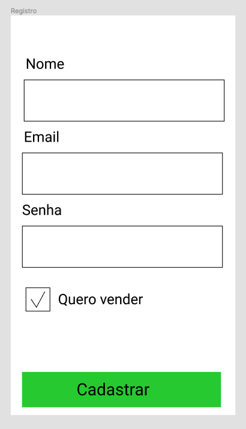

O que será verificado:
```
- Será validado que é possível acessar a tela de registro

- Será validado que contém os atributos descritos no protótipo

- Será validado que não é possível fazer o registro com um nome com menos de 12 letras

- Será validado que não é possível fazer o registro com um nome com caracteres especiais

- Será validado que não é possível fazer o registro com um nome com números

- Será validado que não é possível fazer login com um email inválido

- Será validado que não é possível fazer login com um email já existente

- Será validado que não é possível fazer login com uma senha em branco

- Será validado que não é possível fazer login com uma senha com menos de 6 caracteres

- Será validado que é possível fazer cadastro de um admin com sucesso e ser redirecionado para tela do admin

- Será validado que é possível fazer cadastro de um cliente com sucesso e ser redirecionado para tela do cliente
```

### Cliente

### 3 - Crie o menu top e o menu side bar

- Todos os elementos devem respeitar os atributos descritos no protótipo para o menu superior;

- O menu superior deve sempre ser exibido em todas as telas;

- O título correspondente à tela em que o usuário se encontra deve ser mostrado, confome protótipos;

- Deve haver um ícone do tipo "hambúrguer" no canto superior esquerdo do menu superior. Quando clicado, caso o menu lateral esteja oculto, deve ser mostrado. Caso contrário, o menu lateral deve ser escondido.

- Todos os elementos devem respeitar os atributos descritos no protótipo para o menu lateral;

- Deve conter quatro itens: `"Produtos"`, `"Meus pedidos"`, `"Meu Perfil"` e `"Sair"`;

- Ao clicar no item `"Produtos"`, a pessoa deve ser redirecionada para a tela **Cliente - Produtos**;

- Ao clicar no item `"Meus pedidos"`, a pessoa deve ser redirecionada para a tela **Cliente - Meus Pedidos**;

- Ao clicar no item `"Meu Perfil"`, a pessoa deve ser redirecionada para tela **Cliente - Meu Perfil**;

- Ao clicar no item `"Sair"`, a pessoa deve ser redirecionada para a tela **Login** e ser deslogada.

#### Menu superior

- O título do top 'Trybeer' deverá conter a tag `data-testid="top-title"`

- O botão 'Hamburguer' deverá conter a tag `data-testid="top-hamburguer"`

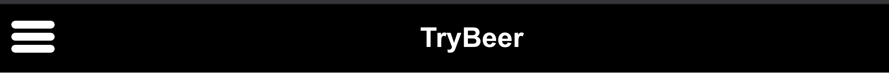

#### Menu lateral

- O componente sidebar deverá conter a seguinte classe `class="side-menu-container"`

- O botão 'Produtos' deverá conter a tag `data-testid="side-menu-item-products"`

- O botão 'Meus Pedidos' deverá conter a tag `data-testid="side-menu-item-my-orders"`

- O botão 'Meu Perfil' deverá conter a tag `data-testid="side-menu-item-my-profile"`

- O botão 'Sair' deverá conter a tag `data-testid="side-menu-item-logout"`


O que será verificado:
```
- Será validado que os atributos do top menu devem ser mostrados confome protótipos

- Será validado que ao clicar no componente hamburguer o sidebar deve ficar visível

- Será validado que os atributos do side menu devem ser mostrados confome protótipos

- Será validado que ao clicar no botão "produtos" será redirecionado para tela de produtos

- Será validado que ao clicar no botão "meus pedidos" será redirecionado para tela de meus pedidos

- Será validado que ao clicar no botão "meu perfil" será redirecionado para tela de meu perfil

- Será validado que ao clicar no botão "sair" será redirecionado para tela home
```

### 4 - Criar tela de perfil do cliente

Esta tela possui o nome `Cliente - Meu Perfil` no protótipo.

- Todos os elementos devem respeitar os atributos descritos no protótipo;

- A rota da tela deve ser `/profile`;

- Deve ter dois campos de texto: um para o `email` e o outro para o `name`. Apenas o `name` pode ser alterado. Dessa forma, o campo `email` deve ser `read-only`;

- Deve ter um botão `"Salvar"`". Caso o usuário tenha editado o nome, o botão deve ser habilitado. Caso contrário, o botão deve estar desabilitado;

- Ao clicar no botão `"Salvar"`, uma requisição deve ser feita à API e o nome da pessoa deve ser atualizado no banco de dados. Quando a atualização terminar, deve-se exibir a mensagem `Atualização concluída com sucesso` na tela;

- Ao entrar na tela, se o usuário não estiver logado, deve ser redirecionado para a tela **Login**.

#### Tela de perfil

- O título do top 'Meu perfil' deverá conter a tag `data-testid="top-title"`

- O campo input 'Name' deverá conter a tag `data-testid="profile-name-input"`

- O campo input 'Email' deverá conter a tag `data-testid="profile-email-input"`

- O botão 'Salvar' deverá conter a tag `data-testid="profile-save-btn"`

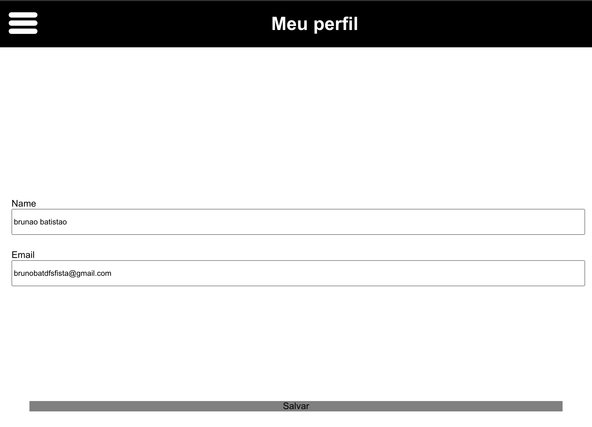

O que será verificado:
```
- Será validado que é possível acessar a tela de perfil do cliente

- Será validado que contém os atributos descritos no protótipo

- Será validado que campo email está como readonly

- Será validado que o botão salvar fique desabilitado caso não altere o nome

- Será validado que o botão salvar fique habilitado caso altere o nome

- Será validado que é possível alterar o nome com sucesso
```

### 5 - Criar Tela de Produtos

Esta tela possui o nome `Cliente - Produtos` no protótipo.

- Todos os elementos devem respeitar os atributos descritos no protótipo para a tela de produtos;

- A rota da tela deve ser `/products`;

- Nessa tela, os produtos devem ser organizados em "cards", e deve haver um card para cada produto;

- Os cards devem conter os seguintes dados do produto:

  - Foto;

  - Nome do produto;

  - Preço unitário;

  - Quantidade atual inserida no carrinho;

  - Botão de adicionar (`+`) e de remover (`-`) uma unidade do produto no carrinho.

- Ao clicar no botão `+`, a quantidade do produto deve aumentar em 1;

- Ao clicar no botão `-`, a quantidade do produto deve diminuir em 1, limitado a 0;

- Caso a pessoa atualize o browser, o carrinho deve ser mantido;

- O preço unitário deve seguir o padrão `R$ 00,00`;

- Quando a quantidade mostrada no card do produto chegar a 0, o produto deve ser removido do carrinho;

- Deve ter um botão `"Ver carrinho"`. Esse botão também deve exibir o **valor total** dos produtos no carrinho;

- O **valor total** mostrado no botão `"Ver carrinho"` deve ser alterado dinamicamente, ou seja, ao adicionar ou remover um produto no carrinho, o valor total deve ser atualizado;

- Ao clicar no botão `"Ver carrinho"`, a pessoa deve ser redirecionada para a página **Cliente - Checkout**.

- Ao entrar na tela, se o usuário não estiver logado, deve ser redirecionado para a tela **Login**.

#### Tela de produtos

- O valor do produto 'R$ 2,20' deverá conter a tag `data-testid="0-product-price"`

- A imagem do produto deverá conter a tag `data-testid="0-product-img"`

- O nome do produto 'Skoll..' deverá conter a tag `data-testid="0-product-name"`

- O botão 'Mais' deverá conter a tag `data-testid="0-product-plus"`

- O botão 'Menos' deverá conter a tag `data-testid="0-product-minus"`

- A quantidade de produtos deverá conter a tag `data-testid="0-product-qtd"`

- O botão 'Ver Carrinho' deverá conter a tag `data-testid="checkout-bottom-btn"`

- O valor total do carrinho deverá conter a tag `data-testid="checkout-bottom-btn-value"`

**[OBS: os campos data-testid deverão ser implementado um index para cada produto sempre comecando pelo index 0, para cada um dessas tags veja os exemplo abaixo:]**

Produto 1:

data-testid="0-product-price"

Produto 2:

data-testid="1-product-price"

Produto 3:

data-testid="2-product-price"

Deverá ser alterado para os seguintes data-testid listados abaixo:

data-testid="0-product-price"

data-testid="0-product-img"

data-testid="0-product-name"

data-testid="0-product-plus"

data-testid="0-product-minus"

data-testid="0-product-qtd"

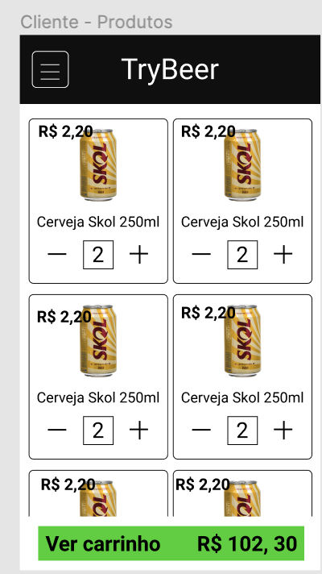

O que será verificado:
```
- Será validado que existe um produto na tela de produtos

- Será validado que existe todos os produtos na tela de produtos

- Será validado que é possíve clicar no botão "+" e atualizar o produto para 1

- Será validado que é possível clicar no botão "-"e atualizar o produto para 0

- Será validado que não é possível clicar no botão "-" e atualizar o produto para menor que zero

- Será validado que é possível visualizar o botão "Ver Carrinho"

- Será validado que é possível atualizar o valor do carrinho ao adicionar um produto

- Será validado que é possível atualizar o valor do carrinho ao remover um produto

- Será validado que ao atualizar a tela continuará na tela de produtos e carrinho com o mesmo valor

- Será validado que é possível adicionar um produto e clicar no botão "Ver Carrinho" e ser redirecionado para tela de carrinho

- Será validado que o botão "Ver Carrinho" fique desabilitado caso não adicione nenhum produto

- Será validado que não é possível acessar a tela de produtos sem estar logado e será redirecionado para tela de login

```
---

### Requisitos Entrega 2

### 6 - Criar Tela de Checkout

Esta tela possui o nome `Cliente - Checkout` no protótipo.

- Todos os elementos devem respeitar os atributos descritos no protótipo para a tela;

- A rota da tela deve ser `/checkout`;

- Caso a pessoa atualize o browser, o carrinho deve ser mantido;

- Deve ter uma lista dos produtos selecionados com a seguinte estrutura: `quantidade do produto -- nome do produto -- valor total do produto`, sendo o valor total calculado por **quantidade \* preço unitário**;

- Ao lado de cada produto deve haver um botão que, quando clicado, exclui este produto do carrinho;

- Abaixo da lista, mostre o **valor total do pedido**, no seguinte formato: `Total: R$ 0,00`. O valor total do pedido é calculado a partir da **soma de todos os valores totais dos produtos**;

- Deve existir um formulário para a pessoa digitar o endereço de entrega dos produtos. O formulário deve conter dois campos de texto: um para a **rua** e o outro para o **número da casa**;

- Deve ter um botão `"Finalizar Pedido"`. O botão deve estar habilitado **apenas** se o valor total do pedido for **maior que zero** e o endereço de entrega estiver preenchido;

- Ao clicar em "`Finalizar pedido`", deve ser feita uma requisição para o backend para salvar o pedido no banco de dados, caso a operação dê certo, a mensagem `Compra realizada com sucesso!` deve ser exibida por **2 segundos** e em seguida a pessoa deve ser redirecionada para a página **Cliente - Produtos**. Caso contrário, deve ser exibido uma mensagem de erro;

- Quando um pedido for finalizado, o carrinho deve ser esvaziado;

- Ao entrar na tela, se o usuário não estiver logado, deve ser redirecionado para a tela **Login**.

#### Tela de Checkout

- O título do top 'Finalizar Pedido' deverá conter a tag `data-testid="top-title"`

- A quantidade do produto deverá conter a tag `data-testid="0-product-qtd-input"`

- O nome do produto deverá conter a tag `data-testid="0-product-name"`

- O valor do produto deverá conter a tag `data-testid="0-product-total-value"`

- O preço unitário do produto deverá conter a tag `data-testid="0-product-unit-price"`

- O botão de remover um produto deverá conter a tag `data-testid="0-removal-button"`

- O valor total do carrinho deverá conter a tag `data-testid="order-total-value"`

- O campo input 'Rua' deverá conter a tag `data-testid="checkout-street-input"`

- O campo input 'Número da casa' deverá conter a tag `data-testid="checkout-house-number-input"`

- O botão 'Finalizar Pedido' deverá conter a tag `data-testid="checkout-finish-btn"`

**[OBS: os campos data-testid deverão ser implementado um index para cada produto sempre comecando pelo index 0, para cada um dessas tags veja os exemplo abaixo:]**

Produto 1:

data-testid="0-product-price"

Produto 2:

data-testid="1-product-price"

Produto 3:

data-testid="2-product-price"

Deverá ser alterado para os seguintes data-testid listados abaixo:

data-testid="0-product-qtd-input"

data-testid="0-product-name"

data-testid="0-product-total-value"

data-testid="0-product-unit-price"

data-testid="0-removal-button"

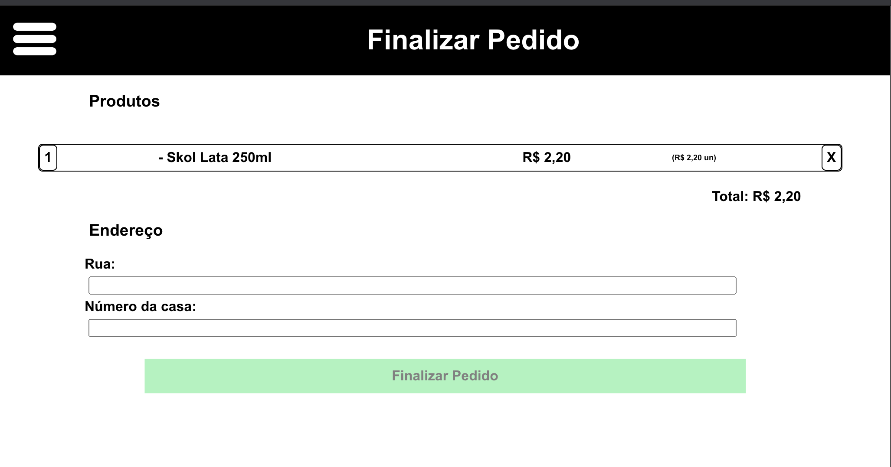

O que será verificado:
```
- Será validado que é possível acessar a tela de checkout

- Será validado que contém atributos descritos no protótipo

- Será validado que é possível ver que o produto tem quantidade, nome e valor total do produto

- Será validado que é possível a lista mostrar o valor total do carrinho

- Será validado que é possível fazer refresh da tela e os dados continuarem na tela

- Será validado que é possível excluir um produto no checkout

- Será validado que ao excluir os produtos aparecerá uma mensagem na tela de:
  `Não há produtos no carrinho` como na imagem abaixo:
```
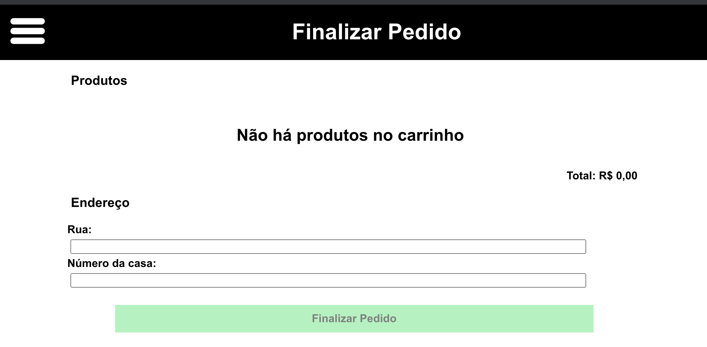
```
- Será validado que é possível o botão finalizar pedido ficar habilitado apenas quando tiver produto maior que zero e rua e numero preenchidos]**

- Será validado que é possível fazer a compra de um produto e ao finalizar ver a mensagem de sucesso e ser redirecionado para tela de produtos

- Será validado que ao fazer a compra com sucesso a mensagem de sucesso "Compra realizada com sucesso!" irá aparecer na tela.

- Será validado que não é possível acessar o checkout sem estar logado e será redirecionado para tela de login
```

### 7 - Criar Tela de Meus Pedidos

Esta tela possui o nome `Cliente - Meus Pedidos` no protótipo.

- Todos os elementos devem respeitar os atributos descritos no protótipo para a tela de meus pedidos;

- A rota da tela deve ser `/orders`;

- Deve conter uma lista de cards, onde cada card é um pedido. Cada card deve conter as seguintes informações: `número do pedido`, `data de realização` e `valor total do pedido`. Para a data de realização do pedido, mostre **apenas o dia e o mês**;

- A listagem deve mostrar os pedidos ordenados por id;

- Ao clicar no card, a pessoa deve ser redirecionada para a página **Cliente - Detalhes do Pedido**.

- Ao entrar na tela, se o usuário não estiver logado, deve ser redirecionado para a tela **Login**.

#### Tela de Meus Pedidos

- O título do top 'Meus Pedidos' deverá conter a tag `data-testid="top-title"`

- O card do pedido deverá conter a tag `data-testid="0-order-card-container"`

- O número do pedido deverá conter a tag `data-testid="0-order-number"`

- A data do pedido deverá conter a tag `data-testid="0-order-date"`

- O valor do pedido deverá conter a tag `data-testid="0-order-total-value"`

**[OBS: os campos data-testid deverão ser implementado um index para cada produto sempre comecando pelo index 0, para cada um dessas tags veja os exemplo abaixo:]**

Produto 1:

data-testid="0-product-price"

Produto 2:

data-testid="1-product-price"

Produto 3:

data-testid="2-product-price"

Deverá ser alterado para os seguintes data-testid listados abaixo:

data-testid="0-order-number"

data-testid="0-order-date"

data-testid="0-order-total-value"

data-testid="0-order-card-container"

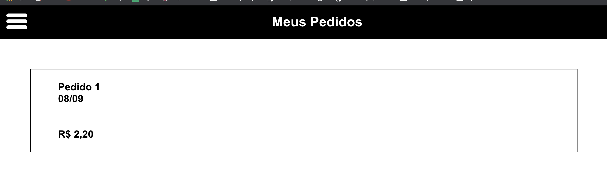

O que será verificado:
```
- Será validado que é possível acessar a tela de meus pedidos

- Será validado que contém os atributos descritos no protótipo

- Será validado que é possível ver que o produto tem quantidade, nome, valor total e a data da compra

- Será validado que é possível clicar no card e ser redirecionado para tela do detalhe do produto

- Será validado que não é possível acessar a tela de meus pedidos sem estar logado e será redirecionado para tela de login
```

### 8 - Criar Tela de Detalhes Pedidos

Esta tela possui o nome `Cliente - Detalhes de Pedido` no protótipo.

- Todos os elementos devem respeitar os atributos descritos no protótipo para a tela de detalhes do pedido;

- A rota da página deve ser `/orders/:numero-do-pedido`;

- Mostre o `número do pedido` e a `data de realização`. Para a data de realização do pedido, mostre apenas o dia e o mês;

- Deve ter uma lista dos produtos selecionados com a seguinte estrutura: `quantidade do produto -- nome do produto -- valor total do produto`. Sendo o valor total calculado por **quantidade \* preço unitário**;

- Abaixo da lista, mostre o `valor total do pedido`. O valor total do pedido é calculado a partir da **soma de todos os valores totais dos produtos**.

- Ao entrar na tela, se o usuário não estiver logado, deve ser redirecionado para a tela **Login**.

titulo - data-testid="top-title" - Detalhes de Pedido
numero do pedido - data-testid="order-number" - Pedido 1
data do pedido - data-testid="order-date" - 03/09
quantidade do produto - data-testid="0-product-qtd" - 1
nome do produto - data-testid="0-product-name" - Skol Lata 250ml
valor do produto - data-testid="0-product-total-value" - R$ 2,20
valor total da compra - data-testid="order-total-value" - Total: R$ 2,20
url - http://localhost:3000/orders/1

#### Tela de detalhes de pedido

- O título do top 'Detalhes de Pedido' deverá conter a tag `data-testid="top-title"`

- O número do pedido deverá conter a tag `data-testid="order-number"`

- A data do pedido deverá conter a tag `data-testid="order-date"`

- A quantidade do produto deverá conter a tag `data-testid="0-product-qtd"`

- O nome do produto deverá conter a tag `data-testid="0-product-name"`

- O valor total do produto deverá conter a tag `data-testid="0-product-total-value"`

- O valor total da compra deverá conter a tag `data-testid="order-total-value"`

**[OBS: os campos data-testid deverão ser implementado um index para cada produto sempre comecando pelo index 0, para cada um dessas tags veja os exemplo abaixo:]**

Produto 1:

data-testid="0-product-price"

Produto 2:

data-testid="1-product-price"

Produto 3:

data-testid="2-product-price"

Deverá ser alterado para os seguintes data-testid listados abaixo:

data-testid="0-product-qtd"

data-testid="0-product-name"

data-testid="0-product-total-value"

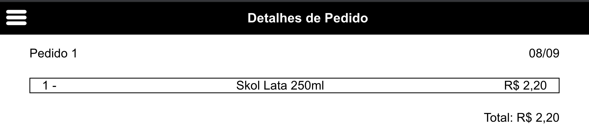

O que será verificado:
```
- Será validado que é possível acessar a tela do detalhe do pedido

- Será validado que contém os atributos descritos no protótipo

- Será validado que é possível ver que tem numero do pedido e a data da compra

- Será validado que é possível ver que o produto tem quantidade, nome e valor total do produto

- Será validado que é possível ver o valor total do pedido

- Será validado que não é possível acessar a tela de meus pedidos sem estar logado e será redirecionado para tela de login
```

### Administrador

### 9 - Criar menu side bar para Administrador

- Todos os elementos devem respeitar os atributos descritos no protótipo para o menu lateral;

- Deve conter três itens: `"Pedidos"`", `"Perfil"`" e "`Sair`";

- Ao clicar no item `"Pedidos"`, a pessoa deve ser redirecionada para a tela **Admin - Home**;

- Ao clicar no item `"Perfil"`, a pessoa deve ser redirecionada para tela **Admin - Perfil**;

- Ao clicar no item `"Sair"`, a pessoa deve ser redirecionada para a tela **Login** e ser deslogada.

#### Menu lateral Administrador

- O componente sidebar deverá conter a seguinte classe `class="admin-side-bar-container"`

- O botão 'Meus Pedidos' deverá conter a tag `data-testid="side-menu-item-orders"`

- O botão 'Meu Perfil' deverá conter a tag `data-testid="side-menu-item-profile"`

- O botão 'Sair' deverá conter a tag `data-testid="side-menu-item-logout"`

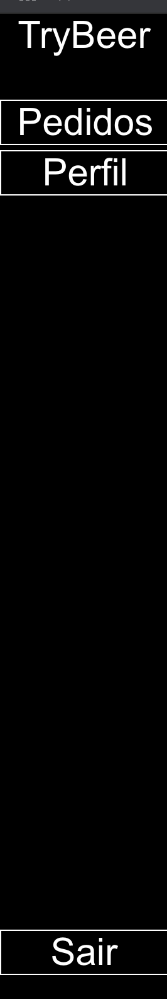

O que será verificado:
```
- Será validado que o sidebar devem ser mostrados, conforme protótipos

- Será validado que ao clicar no menu meus pedidos será redirecionado para tela de meus pedidos'

- Será validado que ao clicar no menu Perfil será redirecionado para tela de Perfil

- Será validado que ao clicar no menu sair será redirecionado para tela home
```

### 10 - Criar tela de perfil de Administrador

Esta tela possui o nome `Admin - Perfil` no protótipo.

- Todos os elementos devem respeitar os atributos descritos no protótipo para a tela de perfil;

- A rota da página deve ser `/admin/profile`;

- Mostrar o `email` e o `nome` do usuário. Não permita que o usuário edite os dados;

- Ao entrar na tela, se o usuário não estiver logado, deve ser redirecionado para a tela **Login**.

#### Tela de perfil Administrador

- O nome deverá conter a seguinte classe `data-testid="profile-name"`

- O email deverá conter a seguinte classe `data-testid="profile-email"`

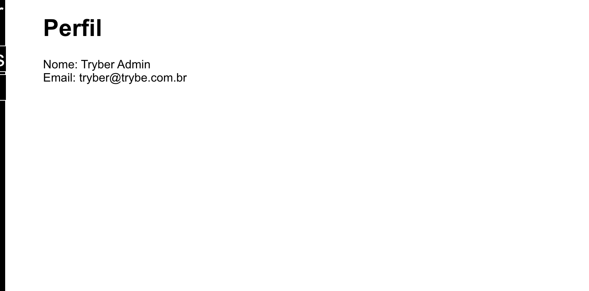

O que será verificado:
```
- Será validado que é possível acessar a tela do perfil do administrador

- Será validado que a tela de perfil contém os atributos descritos no protótipo

- Será validado que a tela de perfil contém o email e nome do administrador

- Será validado que não é possível acessar a tela sem estar autenticado e ser redirecionado para tela de login
```

### 11 - Criar tela de pedidos de admin

Esta tela possui o nome `Admin - Pedidos` no protótipo.

- Todos os elementos devem respeitar os atributos descritos no protótipo para a tela de pedidos;

- A rota da página deve ser `/admin/orders`;

- Essa tela deve mostrar todos os pedidos feitos;

- Os pedidos pendentes devem ter o label `Pendentes`, ao passo que os pedidos entregues devem ter o label `Entregue`;

- Os "cards" dos pedidos devem conter as informações:

  - Número do pedido;

  - Endereço para entrega;

  - Valor total do pedido.

- Ao clicar em qualquer parte do card do pedido, a pessoa deve ser redirecionada para a tela `Admin - Detalhe de Pedido`.

#### Tela de Pedidos

- O numero do pedido deverá conter a seguinte classe `data-testid="0-order-number"`

- O endereço deverá conter a seguinte classe `data-testid="0-order-address"`

- O valor total do pedido deverá conter a seguinte classe `data-testid="0-order-total-value"`

- O valor total do pedido deverá conter a seguinte classe `data-testid="0-order-status"`

**[OBS: os campos data-testid deverão ser implementado um index para cada produto sempre comecando pelo index 0, para cada um dessas tags veja os exemplo abaixo:]**

Produto 1:

data-testid="0-product-price"

Produto 2:

data-testid="1-product-price"

Produto 3:

data-testid="2-product-price"

Deverá ser alterado para os seguintes data-testid listados abaixo:

data-testid="0-order-number"

data-testid="0-order-address"

data-testid="0-order-total-value"

data-testid="0-order-status"

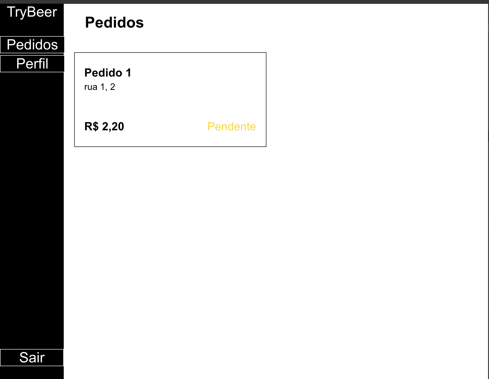

O que será verificado:
```
- Será validado que é possível acessar a tela do pedidos do administrador

- Será validado que a tela de pedidos contém os atributos descritos no protótipo

- Será validado que os dados do card estão corretos

- Será validado que é possível clicar no card do produto e ser redirecionado para tela de detalhes do produto
```

### 12 - Criar tela de Detalhes de admin

Essa página corresponde às páginas `Admin - Detalhes de Pedido - Pendente` e `Admin - Detalhes de Pedido - Entregue` no protótipo.

- Todos os elementos devem respeitar os atributos descritos no protótipo para a tela de detalhes do pedido;

- A rota da página deve ser `/admin/orders/:id`;

- No cabeçalho, mostre o `número do pedido` e o `status` atual - Pendente ou Entregue;

- Deve ter uma listagem com os produtos do pedido, onde cada linha deve conter:

  - Quantidade;

  - Nome do produto;

  - Valor total do produto.

- O `preço total` do produto é calculado usando **quantidade \* preço unitário**;

- Mostre também o `valor total do pedido`. O valor total do pedido é calculado a partir da **soma de todos os valores totais dos produtos**;

- Caso o status do pedido seja **pendente**, um botão para marcar o pedido como entregue deve ser exibido. Caso contrário, não exiba o botão;

- Ao clicar no botão `"Marcar pedido como entregue"`, o status desse pedido deve mudar para `Entregue` e o botão deve desaparecer.

#### Tela de Detalhes de Pedido

- O numero do pedido deverá conter a seguinte classe `data-testid="order-number"`

- O status do pedido deverá conter a seguinte classe `data-testid="order-status"`

- A quantidade do produto deverá conter a seguinte classe `data-testid="0-product-qtd"`

- O nome do produto deverá conter a seguinte classe `data-testid="0-product-name"`

- O valor total do produto deverá conter a seguinte classe `data-testid="0-product-total-value"`

- O preço unitário do produto deverá conter a seguinte classe `data-testid="0-order-unit-price"`

- O valor total do pedido deverá conter a seguinte classe `data-testid="order-total-value"`

- O botão 'Marcar como entregue' deverá conter a seguinte classe `data-testid="mark-as-delivered-btn"`

**[OBS: os campos data-testid deverão ser implementado um index para cada produto sempre comecando pelo index 0, para cada um dessas tags veja os exemplo abaixo:]**

Produto 1:

data-testid="0-product-price"

Produto 2:

data-testid="1-product-price"

Produto 3:

data-testid="2-product-price"

Deverá ser alterado para os seguintes data-testid listados abaixo:

data-testid="0-product-qtd"

data-testid="0-product-name"

data-testid="0-product-total-value"

data-testid="0-order-unit-price"

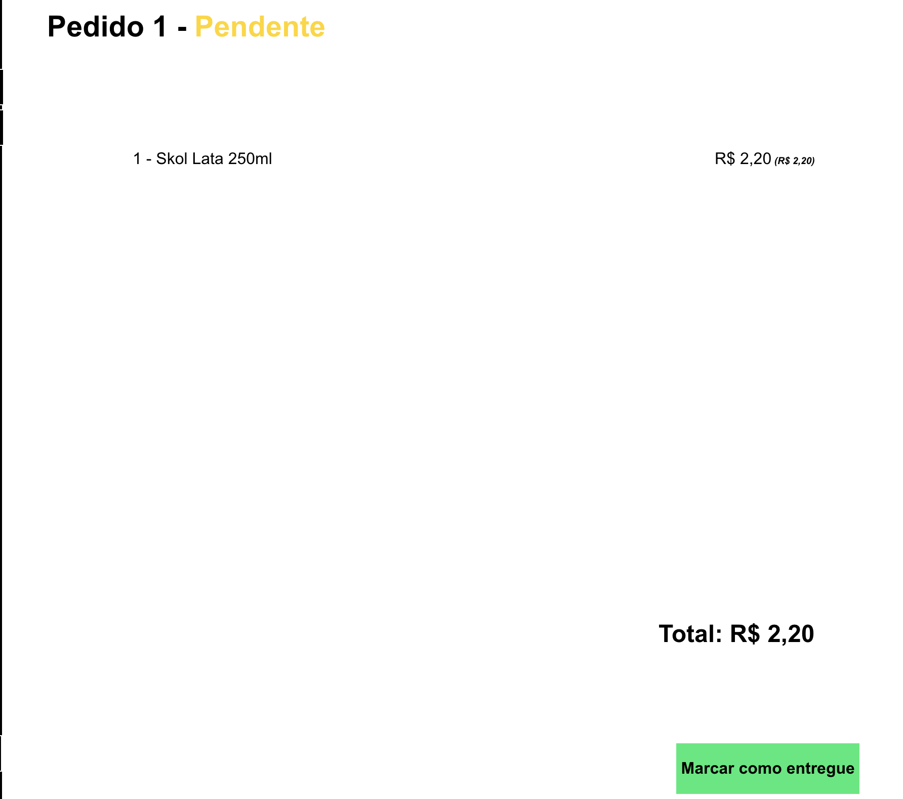

O que será verificado:
```
- Será validado que é possível acessar a tela do detalhe do pedido do administrador

- Será validado que contém os atributos descritos no protótipo

- Será validado que o pedido contém nome e status do pedido

- Será validado que o pedido contém todos os detalhes do pedido

- Será validado que o pedido com status pendente irá apresentar na tela o botão "Marcar como entregue"

- Será validado que o pedido ao marcar como entregue o status mude para entregue" e o botão nao esteja mais visível

- Será validado que o status do pedido fica marcado como entregue como na imagem abaixo:
```
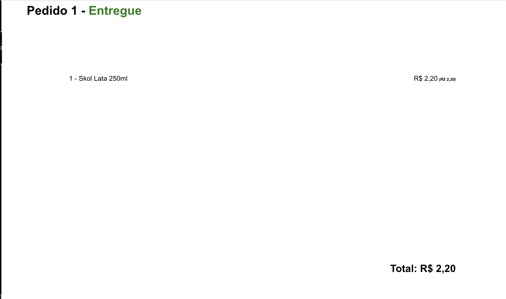
```

- Será validado que o pedido ao marcar como entregue o status mude para entregue" na tela de pedidos admin

- Será validado que o status do pedido fica marcado como entregue como na imagem abaixo:
```
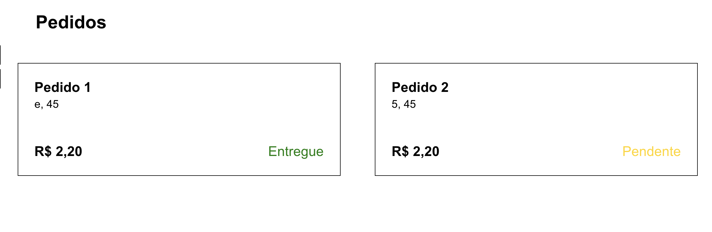

---

### Sobre repositório utilizado para realizar o projeto

[Repositório do projeto Trybe](https://github.com/tryber/sd-06-trybeer)
